# IMGC PAS — Application Flow Design Document

**Document Classification:** Internal — Architecture & Engineering
**Version:** 1.0
**Date:** March 2026
**System:** India Mortgage Guarantee Corporation — Policy Administration System
**Audience:** Enterprise Architects, Senior Engineers, Technical Leadership

---

## Table of Contents

1. [High-Level Design (HLD)](#1-high-level-design)
2. [Low-Level Design (LLD)](#2-low-level-design)
3. [Entity-Relationship Diagram](#3-entity-relationship-diagram)
4. [State Machine Diagrams](#4-state-machine-diagrams)
5. [Sequence Diagrams](#5-sequence-diagrams)
6. [Data Flow Diagrams](#6-data-flow-diagrams)
7. [API Design Reference](#7-api-design-reference)
8. [Deployment Architecture](#8-deployment-architecture)

---

## 1. High-Level Design

### 1.1 System Context Diagram

```
┌─────────────────────────────────────────────────────────────────┐
│                     EXTERNAL ACTORS                             │
│                                                                 │
│  [Lender/Bank]  [Borrower]  [Regulator]  [Auditor]  [Partner]  │
└────────┬───────────┬────────────┬────────────┬──────────┬───────┘
         │           │            │            │          │
         ▼           ▼            ▼            ▼          ▼
┌─────────────────────────────────────────────────────────────────┐
│                    API GATEWAY / WAF                            │
│              (Rate Limiting · Auth · Logging)                   │
└────────────────────────────┬────────────────────────────────────┘
                             │
         ┌───────────────────┼───────────────────┐
         ▼                   ▼                   ▼
┌─────────────────┐ ┌─────────────────┐ ┌─────────────────┐
│  IMGC PAS       │ │  Notification   │ │  Document       │
│  Frontend       │ │  Service        │ │  Store          │
│  (Next.js 14)   │ │  (Email/SMS)    │ │  (S3 / Azure)   │
└────────┬────────┘ └─────────────────┘ └─────────────────┘
         │
         ▼
┌─────────────────────────────────────────────────────────────────┐
│                  IMGC PAS Backend (Express.js)                  │
│                                                                 │
│  ┌──────────┐ ┌──────────┐ ┌──────────┐ ┌──────────────────┐  │
│  │  Policy  │ │  Claims  │ │   UW     │ │    Billing       │  │
│  │  Module  │ │  Module  │ │  Engine  │ │    Module        │  │
│  └──────────┘ └──────────┘ └──────────┘ └──────────────────┘  │
│  ┌──────────┐ ┌──────────┐ ┌──────────┐ ┌──────────────────┐  │
│  │  Auth /  │ │  Report  │ │  Admin   │ │   Compliance     │  │
│  │  RBAC    │ │  Engine  │ │  Module  │ │   Module         │  │
│  └──────────┘ └──────────┘ └──────────┘ └──────────────────┘  │
└────────────────────────────┬────────────────────────────────────┘
                             │
         ┌───────────────────┼───────────────────┐
         ▼                   ▼                   ▼
┌─────────────────┐ ┌─────────────────┐ ┌─────────────────┐
│   PostgreSQL    │ │   Redis Cache   │ │  Audit Log DB   │
│   (Primary DB)  │ │   (Sessions/   │ │  (Immutable)    │
│                 │ │    Cache)       │ │                 │
└─────────────────┘ └─────────────────┘ └─────────────────┘
```

### 1.2 Component Architecture

```
┌─────────────────────────────────────────────────────────────────┐
│                        FRONTEND LAYER                           │
│                         (Next.js 14)                            │
│                                                                 │
│  ┌─────────────┐  ┌─────────────┐  ┌─────────────┐            │
│  │   Pages /   │  │  Component  │  │  State Mgmt │            │
│  │   Routes    │  │  Library    │  │  (Zustand)  │            │
│  │  (20+ mod)  │  │  (45+ comp) │  │             │            │
│  └─────────────┘  └─────────────┘  └─────────────┘            │
│  ┌─────────────┐  ┌─────────────┐  ┌─────────────┐            │
│  │  API Client │  │  Auth Layer │  │  TanStack   │            │
│  │  (Axios)    │  │  (JWT/Ctx)  │  │  Query      │            │
│  └─────────────┘  └─────────────┘  └─────────────┘            │
└──────────────────────────┬──────────────────────────────────────┘
                           │ HTTPS / REST
┌──────────────────────────▼──────────────────────────────────────┐
│                       BACKEND LAYER                             │
│                    (Express.js + TypeScript)                    │
│                                                                 │
│  ┌──────────────────────────────────────────────────────────┐  │
│  │                      MIDDLEWARE CHAIN                     │  │
│  │  CORS → Rate Limit → JWT Auth → RBAC → Zod Validation   │  │
│  │  → Request Logger → Error Handler → Audit Logger         │  │
│  └──────────────────────────────────────────────────────────┘  │
│                                                                 │
│  ┌──────────┐ ┌──────────┐ ┌──────────┐ ┌──────────────────┐  │
│  │  Route   │ │Controller│ │ Service  │ │   Repository     │  │
│  │  Layer   │→│  Layer   │→│  Layer   │→│   Layer (DAO)    │  │
│  │(18 files)│ │(18 ctrl) │ │(19 svc)  │ │                  │  │
│  └──────────┘ └──────────┘ └──────────┘ └──────────────────┘  │
└──────────────────────────┬──────────────────────────────────────┘
                           │
┌──────────────────────────▼──────────────────────────────────────┐
│                        DATA LAYER                               │
│  PostgreSQL · Redis · File Store · Audit Log Store              │
└─────────────────────────────────────────────────────────────────┘
```

### 1.3 Module Catalogue

| Module | Responsibility | Key Entities |
|---|---|---|
| **Auth / RBAC** | Login, JWT issuance, role enforcement | User, Role, Session |
| **Policy** | Full policy lifecycle management | Policy, PolicyVersion, Endorsement, Renewal |
| **QDE** | Quick Data Entry — initial quote capture | Draft Policy, Customer Ref |
| **DDE** | Detailed Data Entry — complete application | Policy, Documents, UW trigger |
| **Underwriting** | Risk evaluation, rule engine, referrals | UWRecord, Rule, Referral, Authority |
| **Claims** | FNOL, adjudication, reserves, fraud | Claim, FNOL, Reserve, FraudAssessment |
| **Billing** | Invoicing, payments, ledger | BillingAccount, Invoice, Payment, Ledger |
| **Servicing** | NPA, delinquency, file upload | NPA Record, Delinquency |
| **Documents** | Upload, versioning, template generation | PolicyDocument, Template |
| **Tasks** | Work item assignment and tracking | Task, Assignment |
| **Notifications** | Email/SMS dispatch | Notification, Template |
| **Reports** | Analytics, KPI dashboards | Report, KPI Metric |
| **Compliance** | Regulatory obligation tracking | ComplianceRequirement |
| **Admin** | User, role, product, master data setup | User, Product, Config |
| **Audit** | Immutable activity trail | AuditLog, ActivityEvent |

---

## 2. Low-Level Design

### 2.1 Backend Layer Design

```
backend/src/
├── app.ts                    # Express app bootstrap
├── server.ts                 # HTTP server entry point
├── config/
│   ├── env.ts                # Environment variable validation (Zod)
│   ├── jwt.ts                # JWT secret and options
│   └── cors.ts               # CORS allow-list configuration
├── middleware/
│   ├── auth.middleware.ts     # JWT extraction and verification
│   ├── rbac.middleware.ts     # Role-based access control guard
│   ├── validate.middleware.ts # Zod request schema validation
│   ├── rateLimiter.ts         # Per-IP / per-user rate limiting
│   ├── audit.middleware.ts    # Immutable audit log writer
│   ├── errorHandler.ts        # Centralised error response formatter
│   └── requestLogger.ts       # Structured Winston request logging
├── routes/                    # 18 route files — thin, delegate to controllers
├── controllers/               # 18 controllers — HTTP in/out, no business logic
├── services/                  # 19 services — all business logic
├── repositories/              # Data access objects (DAOs)
├── models/                    # TypeScript interfaces and types
├── validators/                # Zod schemas per entity
├── utils/
│   ├── jwt.utils.ts
│   ├── crypto.utils.ts
│   ├── pagination.utils.ts
│   └── response.utils.ts
└── mock-data/                 # 27 JSON persistence files (dev/demo)
```

### 2.2 Request Processing Pipeline

```
Incoming HTTP Request
        │
        ▼
┌───────────────────┐
│   CORS Check      │  Allow-listed origins only
└────────┬──────────┘
         ▼
┌───────────────────┐
│  Rate Limiter     │  100 req/15min per IP; 1000/min per user
└────────┬──────────┘
         ▼
┌───────────────────┐
│  JWT Auth         │  Verify Bearer token, extract payload
└────────┬──────────┘
         ▼
┌───────────────────┐
│  RBAC Guard       │  Match role against route permission matrix
└────────┬──────────┘
         ▼
┌───────────────────┐
│  Zod Validation   │  Parse and validate request body / query
└────────┬──────────┘
         ▼
┌───────────────────┐
│  Controller       │  Extract params, call service, format response
└────────┬──────────┘
         ▼
┌───────────────────┐
│  Service Layer    │  Business logic, orchestration, events
└────────┬──────────┘
         ▼
┌───────────────────┐
│  Repository/DAO   │  Data read/write, cache check
└────────┬──────────┘
         ▼
┌───────────────────┐
│  Database / Cache │  PostgreSQL / Redis
└────────┬──────────┘
         ▼
┌───────────────────┐
│  Audit Logger     │  Write immutable audit entry (async)
└────────┬──────────┘
         ▼
    HTTP Response
```

### 2.3 RBAC Permission Matrix

| Module / Action | Admin | Operations | Underwriter | Claims | Viewer |
|---|:---:|:---:|:---:|:---:|:---:|
| User Management | ✅ | ❌ | ❌ | ❌ | ❌ |
| Product / Master Config | ✅ | ❌ | ❌ | ❌ | ❌ |
| Policy — Create (QDE/DDE) | ✅ | ✅ | ❌ | ❌ | ❌ |
| Policy — View | ✅ | ✅ | ✅ | ✅ | ✅ |
| Policy — Endorse / Renew | ✅ | ✅ | ❌ | ❌ | ❌ |
| Policy — Cancel | ✅ | ✅ | ❌ | ❌ | ❌ |
| Underwriting — Evaluate | ✅ | ❌ | ✅ | ❌ | ❌ |
| Underwriting — Override | ✅ | ❌ | ✅ (limit) | ❌ | ❌ |
| Claims — File FNOL | ✅ | ✅ | ❌ | ✅ | ❌ |
| Claims — Adjudicate | ✅ | ❌ | ❌ | ✅ | ❌ |
| Claims — Settle | ✅ | ❌ | ❌ | ✅ | ❌ |
| Billing — Invoice | ✅ | ✅ | ❌ | ❌ | ❌ |
| Billing — Record Payment | ✅ | ✅ | ❌ | ❌ | ❌ |
| Reports — View | ✅ | ✅ | ✅ | ✅ | ✅ |
| Reports — Export | ✅ | ✅ | ❌ | ❌ | ❌ |
| Audit Logs — View | ✅ | ❌ | ❌ | ❌ | ❌ |
| Compliance — Manage | ✅ | ✅ | ❌ | ❌ | ❌ |

### 2.4 Service Layer Design

Each service follows a consistent contract:

```typescript
// Pattern: Service Interface Contract
interface PolicyService {
  // Query
  findById(id: string): Promise<Policy>
  findAll(filters: PolicyFilter, pagination: Pagination): Promise<PagedResult<Policy>>

  // Commands
  createDraft(data: CreatePolicyDto, actor: JwtPayload): Promise<Policy>
  submitForUnderwriting(id: string, actor: JwtPayload): Promise<Policy>
  issue(id: string, actor: JwtPayload): Promise<Policy>
  endorse(id: string, data: EndorsementDto, actor: JwtPayload): Promise<Endorsement>
  renew(id: string, data: RenewalDto, actor: JwtPayload): Promise<Renewal>
  cancel(id: string, reason: string, actor: JwtPayload): Promise<Policy>

  // Cross-cutting
  getVersionHistory(id: string): Promise<PolicyVersion[]>
  calculatePremium(data: PremiumCalcInput): Promise<PremiumCalculation>
}
```

### 2.5 Data Access Layer

```
Repository Pattern — each entity has a dedicated repository

PolicyRepository
  ├── findById(id)
  ├── findAll(filter, page)
  ├── create(data)
  ├── update(id, data)
  ├── saveVersion(policyId, changes, actor)
  └── findByCustomerId(customerId)

ClaimRepository
  ├── findById(id)
  ├── findByPolicyId(policyId)
  ├── create(data)
  ├── updateStatus(id, status, actor)
  └── findByStatus(status, page)

BillingRepository
  ├── findAccountByPolicyId(policyId)
  ├── createInvoice(data)
  ├── recordPayment(data)
  ├── addLedgerEntry(data)
  └── getAgingReport()
```

### 2.6 Frontend Module Map

```
frontend/app/
├── (auth)/
│   └── login/                # Public login page
└── (main)/                   # Protected — requires JWT
    ├── dashboard/             # Executive KPI dashboard
    ├── service-desk/          # QDE intake form
    ├── dde/                   # Detailed data entry
    ├── policies/              # Policy list + detail
    │   └── [id]/
    │       ├── page.tsx       # Policy overview
    │       ├── endorsements/  # Endorsement management
    │       └── renewals/      # Renewal management
    ├── underwriting/          # UW queue + evaluation
    ├── claims/                # Claims list
    │   └── [id]/              # Claim detail + adjudication
    ├── fnol/                  # FNOL intake
    ├── billing/               # Billing accounts + invoices
    ├── customers/             # Customer profiles
    ├── documents/             # Document repository
    ├── tasks/                 # Work item queue
    ├── reports/               # Analytics + exports
    ├── compliance/            # Compliance register
    ├── audit-logs/            # Audit trail viewer
    ├── admin/                 # System administration
    └── master-setup/          # Reference data configuration
```

---

## 3. Entity-Relationship Diagram


```mermaid
erDiagram

    %% ── IDENTITY & ACCESS ──────────────────────────────────
    USERS {
        string id PK
        string email UK
        string name
        string role
        string hashedPassword
        boolean isActive
        timestamp createdAt
        timestamp updatedAt
    }

    SESSIONS {
        string id PK
        string userId FK
        string refreshToken
        timestamp expiresAt
        string ipAddress
        timestamp createdAt
    }

    AUDIT_LOGS {
        string id PK
        string userId FK
        string action
        string entityType
        string entityId
        jsonb before
        jsonb after
        string ipAddress
        timestamp createdAt
    }

    %% ── MASTER / REFERENCE ──────────────────────────────────
    PRODUCTS {
        string id PK
        string name
        string code UK
        string description
        string status
        string policyType
        jsonb coverageOptions
        jsonb ratingFactors
        jsonb eligibilityCriteria
        jsonb requiredDocuments
        integer defaultTermMonths
        decimal minPremium
        decimal maxPremium
        decimal commissionRate
        string createdBy FK
        timestamp createdAt
        timestamp updatedAt
    }

    UW_RULES {
        string id PK
        string name
        string category
        string criteria
        string field
        string operator
        jsonb value
        string decision
        string notes
        boolean isActive
        integer priority
        timestamp createdAt
        timestamp updatedAt
    }

    DOCUMENT_TEMPLATES {
        string id PK
        string name
        string type
        string description
        string category
        jsonb fields
        timestamp createdAt
    }

    %% ── CUSTOMER ────────────────────────────────────────────
    CUSTOMERS {
        string id PK
        string name
        string email UK
        string phone
        string panNumber UK
        string aadhaarNumber
        string addressLine1
        string addressLine2
        string city
        string state
        string pincode
        string customerType
        string status
        string kycStatus
        timestamp createdAt
        timestamp updatedAt
        string createdBy FK
    }

    %% ── POLICY LIFECYCLE ────────────────────────────────────
    POLICIES {
        string id PK
        string customerId FK
        string productId FK
        string policyNumber UK
        string policyType
        string status
        decimal premiumAmount
        decimal coverageAmount
        date startDate
        date endDate
        string underwritingDecision
        string riskCategory
        integer version
        string parentPolicyId FK
        string renewalOf FK
        string createdBy FK
        timestamp createdAt
        timestamp updatedAt
    }

    POLICY_VERSIONS {
        string id PK
        string policyId FK
        integer version
        jsonb changes
        string changedBy FK
        timestamp timestamp
    }

    ENDORSEMENTS {
        string id PK
        string policyId FK
        string type
        string description
        jsonb changes
        decimal premiumDelta
        date effectiveDate
        string status
        string createdBy FK
        string approvedBy FK
        timestamp approvedAt
        timestamp createdAt
    }

    RENEWALS {
        string id PK
        string originalPolicyId FK
        string renewedPolicyId FK
        date renewalDate
        decimal newPremiumAmount
        decimal newCoverageAmount
        date newStartDate
        date newEndDate
        decimal premiumChange
        string status
        boolean uwReEvaluated
        decimal newRiskScore
        string createdBy FK
        timestamp createdAt
    }

    %% ── UNDERWRITING ─────────────────────────────────────────
    UW_RECORDS {
        string id PK
        string policyId FK
        integer applicantAge
        integer creditScore
        decimal income
        decimal propertyValue
        decimal ltvRatio
        string propertyZone
        decimal annualPremium
        decimal riskScore
        string decision
        jsonb rulesApplied
        jsonb ruleResults
        string notes
        string evaluatedBy FK
        timestamp evaluatedAt
        boolean overridden
        string overrideBy FK
        string overrideReason
        string referralId FK
    }

    UW_REFERRALS {
        string id PK
        string underwritingId FK
        string policyId FK
        string assignedTo FK
        string assignedBy FK
        string status
        string priority
        string reason
        jsonb triggerRules
        decimal riskScore
        string notes
        string resolution
        string resolvedBy FK
        timestamp resolvedAt
        timestamp slaDeadline
        timestamp createdAt
        timestamp updatedAt
    }

    UW_AUTHORITY {
        string id PK
        string userId FK
        decimal maxCoverageAmount
        decimal maxRiskScore
        jsonb allowedDecisions
        boolean canOverride
        string updatedBy FK
        timestamp updatedAt
    }

    %% ── CLAIMS ───────────────────────────────────────────────
    FNOL {
        string id PK
        string policyId FK
        string claimType
        date incidentDate
        string incidentLocation
        string description
        string reportedBy
        string contactPhone
        string contactEmail
        string damageDescription
        decimal estimatedAmount
        jsonb partiesInvolved
        jsonb documents
        string status
        string claimId FK
        string createdBy FK
        timestamp createdAt
    }

    CLAIMS {
        string id PK
        string policyId FK
        string fnolId FK
        string claimNumber UK
        string claimType
        string description
        decimal amount
        string status
        string adjudicationStatus
        date filedDate
        date reviewDate
        date settlementDate
        decimal settlementAmount
        jsonb documents
        string assignedTo FK
        decimal reserveAmount
        decimal fraudScore
        jsonb fraudIndicators
        string createdBy FK
        timestamp updatedAt
    }

    RESERVES {
        string id PK
        string claimId FK
        string type
        decimal amount
        decimal previousAmount
        string reason
        string createdBy FK
        timestamp createdAt
    }

    FRAUD_ASSESSMENTS {
        string id PK
        string claimId FK
        decimal score
        string level
        jsonb indicators
        timestamp assessedAt
    }

    LOSS_MITIGATIONS {
        string id PK
        string claimId FK
        string type
        string description
        string status
        date startDate
        date endDate
        string terms
        string createdBy FK
        timestamp createdAt
    }

    %% ── BILLING ──────────────────────────────────────────────
    BILLING_ACCOUNTS {
        string id PK
        string policyId FK
        string customerId FK
        string paymentFrequency
        decimal totalPremium
        decimal balance
        string status
        string paymentMethod
        boolean autopay
        integer gracePeriodDays
        date nextDueDate
        date lastPaymentDate
        decimal lastPaymentAmount
        timestamp createdAt
        timestamp updatedAt
    }

    INVOICES {
        string id PK
        string billingAccountId FK
        string policyId FK
        string invoiceNumber UK
        decimal amount
        decimal amountPaid
        date dueDate
        string status
        jsonb lineItems
        date issuedDate
        date paidDate
        timestamp createdAt
    }

    PAYMENTS {
        string id PK
        string billingAccountId FK
        string invoiceId FK
        string policyId FK
        decimal amount
        string method
        string reference
        string status
        date processedDate
        string recordedBy FK
        string notes
        timestamp createdAt
    }

    LEDGER_ENTRIES {
        string id PK
        string billingAccountId FK
        string policyId FK
        string type
        string description
        decimal debit
        decimal credit
        decimal balance
        string referenceId
        date date
        timestamp createdAt
    }

    INSTALLMENT_PLANS {
        string id PK
        string billingAccountId FK
        string policyId FK
        decimal totalPremium
        string frequency
        integer numberOfInstallments
        decimal installmentAmount
        jsonb installments
        timestamp createdAt
    }

    %% ── DOCUMENTS ────────────────────────────────────────────
    DOCUMENTS {
        string id PK
        string policyId FK
        string claimId FK
        string type
        string category
        string filename
        string mimeType
        integer size
        string uploadedBy FK
        integer version
        string parentDocumentId FK
        string generatedFrom FK
        jsonb metadata
        timestamp uploadDate
    }

    %% ── TASKS & NOTIFICATIONS ────────────────────────────────
    TASKS {
        string id PK
        string title
        string description
        string type
        string status
        string priority
        string assignedTo FK
        string assignedBy FK
        string relatedEntityType
        string relatedEntityId
        date dueDate
        timestamp completedAt
        timestamp createdAt
        timestamp updatedAt
    }

    NOTIFICATIONS {
        string id PK
        string userId FK
        string type
        string title
        string message
        string channel
        boolean isRead
        string relatedEntityType
        string relatedEntityId
        timestamp sentAt
        timestamp readAt
        timestamp createdAt
    }

    %% ── COMPLIANCE ───────────────────────────────────────────
    COMPLIANCE_REQUIREMENTS {
        string id PK
        string name
        string description
        string category
        string authority
        string status
        date dueDate
        date completedDate
        string assignedTo FK
        string evidence
        string notes
        string priority
        string recurrence
        timestamp createdAt
        timestamp updatedAt
    }

    %% ── BULK OPERATIONS ──────────────────────────────────────
    BULK_OPERATIONS {
        string id PK
        string type
        string status
        integer totalItems
        integer processedItems
        integer successCount
        integer failureCount
        jsonb results
        jsonb parameters
        string createdBy FK
        timestamp startedAt
        timestamp completedAt
    }

    %% ── RELATIONSHIPS ────────────────────────────────────────
    USERS ||--o{ SESSIONS : "has"
    USERS ||--o{ AUDIT_LOGS : "generates"
    USERS ||--o{ POLICIES : "creates"
    USERS ||--o{ UW_AUTHORITY : "granted"

    CUSTOMERS ||--o{ POLICIES : "holds"
    CUSTOMERS ||--o{ BILLING_ACCOUNTS : "has"

    PRODUCTS ||--o{ POLICIES : "governs"

    POLICIES ||--o{ POLICY_VERSIONS : "versioned by"
    POLICIES ||--o{ ENDORSEMENTS : "has"
    POLICIES ||--o{ RENEWALS : "renewed via"
    POLICIES ||--|| UW_RECORDS : "evaluated by"
    POLICIES ||--o{ CLAIMS : "subject to"
    POLICIES ||--o{ DOCUMENTS : "has"
    POLICIES ||--|| BILLING_ACCOUNTS : "billed via"
    POLICIES ||--o{ INVOICES : "invoiced"
    POLICIES ||--o{ LEDGER_ENTRIES : "tracked in"

    UW_RECORDS ||--o{ UW_REFERRALS : "triggers"

    FNOL ||--o| CLAIMS : "becomes"
    CLAIMS ||--o{ RESERVES : "has"
    CLAIMS ||--o| FRAUD_ASSESSMENTS : "assessed by"
    CLAIMS ||--o{ LOSS_MITIGATIONS : "managed via"
    CLAIMS ||--o{ DOCUMENTS : "supported by"

    BILLING_ACCOUNTS ||--o{ INVOICES : "generates"
    BILLING_ACCOUNTS ||--o{ PAYMENTS : "receives"
    BILLING_ACCOUNTS ||--o{ LEDGER_ENTRIES : "records"
    BILLING_ACCOUNTS ||--o| INSTALLMENT_PLANS : "may have"

    INVOICES ||--o{ PAYMENTS : "settled by"

    DOCUMENTS }o--|| DOCUMENT_TEMPLATES : "generated from"

    USERS ||--o{ TASKS : "assigned to"
    USERS ||--o{ NOTIFICATIONS : "receives"
    USERS ||--o{ COMPLIANCE_REQUIREMENTS : "responsible for"
```

---

## 4. State Machine Diagrams

### 4.1 Policy Lifecycle State Machine

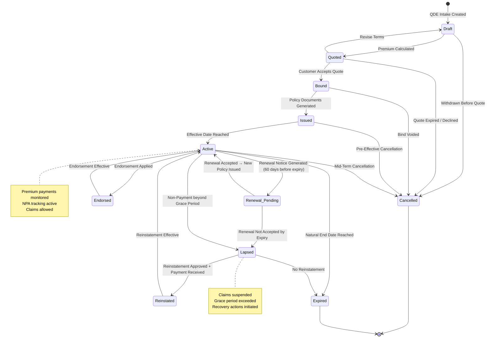
```mermaid
stateDiagram-v2
    [*] --> Draft : QDE Intake Created

    Draft --> Quoted : Premium Calculated
    Draft --> Cancelled : Withdrawn Before Quote

    Quoted --> Bound : Customer Accepts Quote
    Quoted --> Draft : Revise Terms
    Quoted --> Cancelled : Quote Expired / Declined

    Bound --> Issued : Policy Documents Generated
    Bound --> Cancelled : Bind Voided

    Issued --> Active : Effective Date Reached
    Issued --> Cancelled : Pre-Effective Cancellation

    Active --> Endorsed : Endorsement Applied
    Endorsed --> Active : Endorsement Effective

    Active --> Renewal_Pending : Renewal Notice Generated (60 days before expiry)
    Renewal_Pending --> Active : Renewal Accepted → New Policy Issued
    Renewal_Pending --> Lapsed : Renewal Not Accepted by Expiry

    Active --> Lapsed : Non-Payment beyond Grace Period
    Lapsed --> Reinstated : Reinstatement Approved + Payment Received

    Active --> Cancelled : Mid-Term Cancellation
    Reinstated --> Active : Reinstatement Effective

    Active --> Expired : Natural End Date Reached
    Lapsed --> Expired : No Reinstatement

    Cancelled --> [*]
    Expired --> [*]

    note right of Active
        Premium payments monitored
        NPA tracking active
        Claims allowed
    end note

    note right of Lapsed
        Claims suspended
        Grace period exceeded
        Recovery actions initiated
    end note
```

### 4.2 Claim Lifecycle State Machine

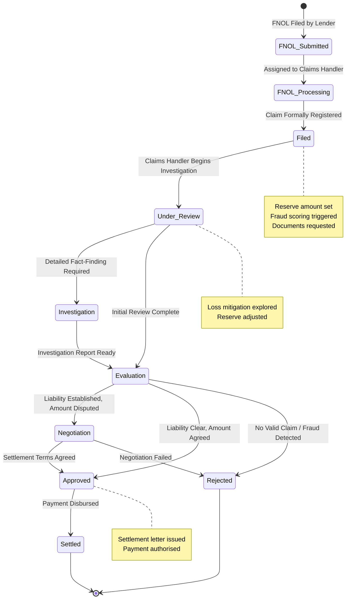
```mermaid
stateDiagram-v2
    [*] --> FNOL_Submitted : FNOL Filed by Lender

    FNOL_Submitted --> FNOL_Processing : Assigned to Claims Handler
    FNOL_Processing --> Filed : Claim Formally Registered

    Filed --> Under_Review : Claims Handler Begins Investigation

    Under_Review --> Investigation : Detailed Fact-Finding Required
    Under_Review --> Evaluation : Initial Review Complete
    Investigation --> Evaluation : Investigation Report Ready

    Evaluation --> Negotiation : Liability Established, Amount Disputed
    Evaluation --> Approved : Liability Clear, Amount Agreed
    Evaluation --> Rejected : No Valid Claim / Fraud Detected

    Negotiation --> Approved : Settlement Terms Agreed
    Negotiation --> Rejected : Negotiation Failed

    Approved --> Settled : Payment Disbursed
    Rejected --> [*]
    Settled --> [*]

    note right of Filed
        Reserve amount set
        Fraud scoring triggered
        Documents requested
    end note

    note right of Under_Review
        Loss mitigation explored
        Reserve adjusted
    end note

    note right of Approved
        Settlement letter issued
        Payment authorised
    end note
```

### 4.3 Underwriting Decision State Machine

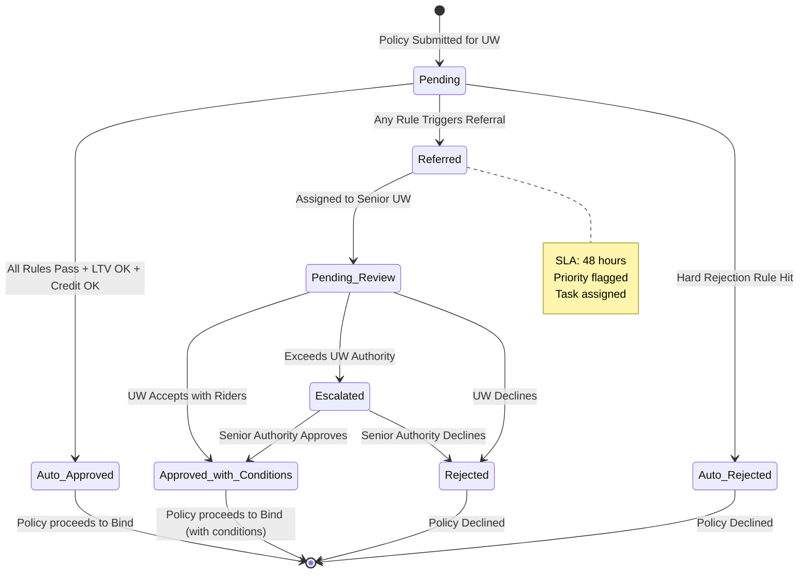
```mermaid
stateDiagram-v2
    [*] --> Pending : Policy Submitted for UW

    Pending --> Auto_Approved : All Rules Pass + LTV OK + Credit OK
    Pending --> Referred : Any Rule Triggers Referral
    Pending --> Auto_Rejected : Hard Rejection Rule Hit

    Referred --> Pending_Review : Assigned to Senior UW
    Pending_Review --> Approved_with_Conditions : UW Accepts with Riders
    Pending_Review --> Escalated : Exceeds UW Authority
    Pending_Review --> Rejected : UW Declines

    Escalated --> Approved_with_Conditions : Senior Authority Approves
    Escalated --> Rejected : Senior Authority Declines

    Auto_Approved --> [*] : Policy proceeds to Bind
    Approved_with_Conditions --> [*] : Policy proceeds to Bind (with conditions)
    Auto_Rejected --> [*] : Policy Declined
    Rejected --> [*] : Policy Declined

    note right of Referred
        SLA: 48 hours
        Priority flagged
        Task assigned
    end note
```

### 4.4 Invoice / Payment State Machine

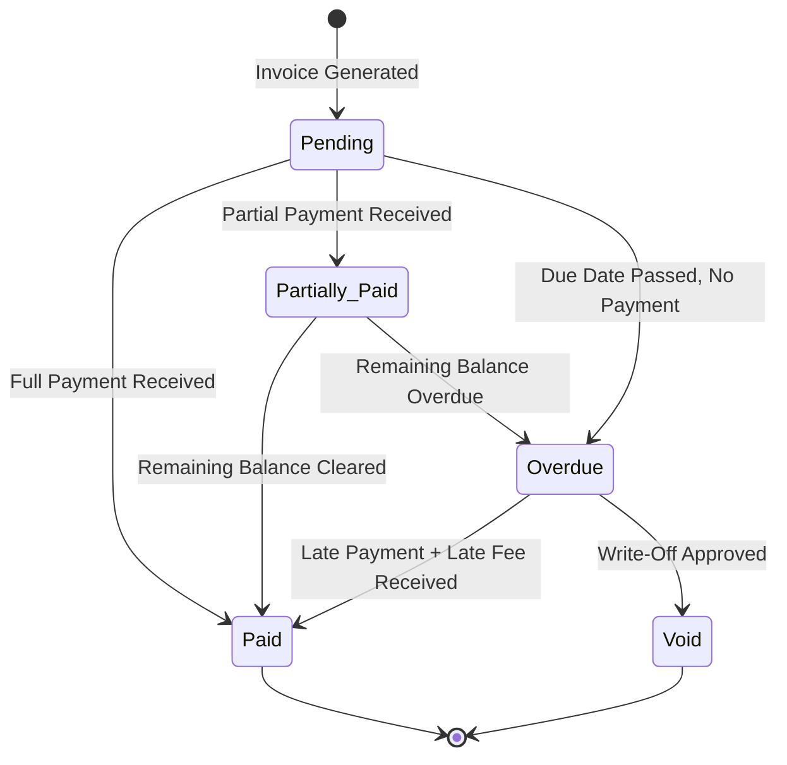
```mermaid
stateDiagram-v2
    [*] --> Pending : Invoice Generated

    Pending --> Paid : Full Payment Received
    Pending --> Partially_Paid : Partial Payment Received
    Pending --> Overdue : Due Date Passed, No Payment

    Partially_Paid --> Paid : Remaining Balance Cleared
    Partially_Paid --> Overdue : Remaining Balance Overdue

    Overdue --> Paid : Late Payment + Late Fee Received
    Overdue --> Void : Write-Off Approved

    Paid --> [*]
    Void --> [*]
```

### 4.5 Endorsement State Machine

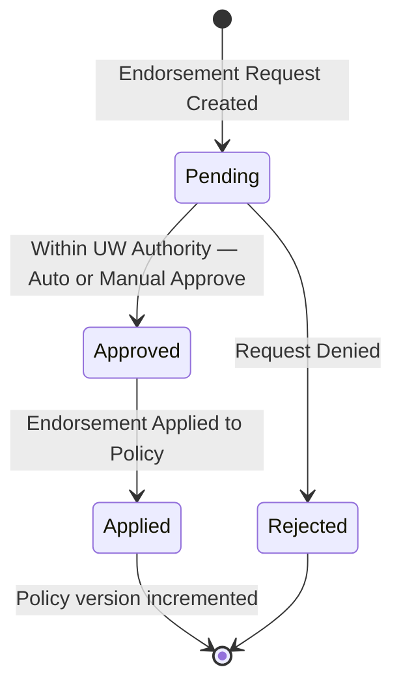
```mermaid
stateDiagram-v2
    [*] --> Pending : Endorsement Request Created

    Pending --> Approved : Within UW Authority — Auto or Manual Approve
    Pending --> Rejected : Request Denied

    Approved --> Applied : Endorsement Applied to Policy
    Applied --> [*] : Policy version incremented
    Rejected --> [*]
```

---

## 5. Sequence Diagrams

### 5.1 Authentication Flow

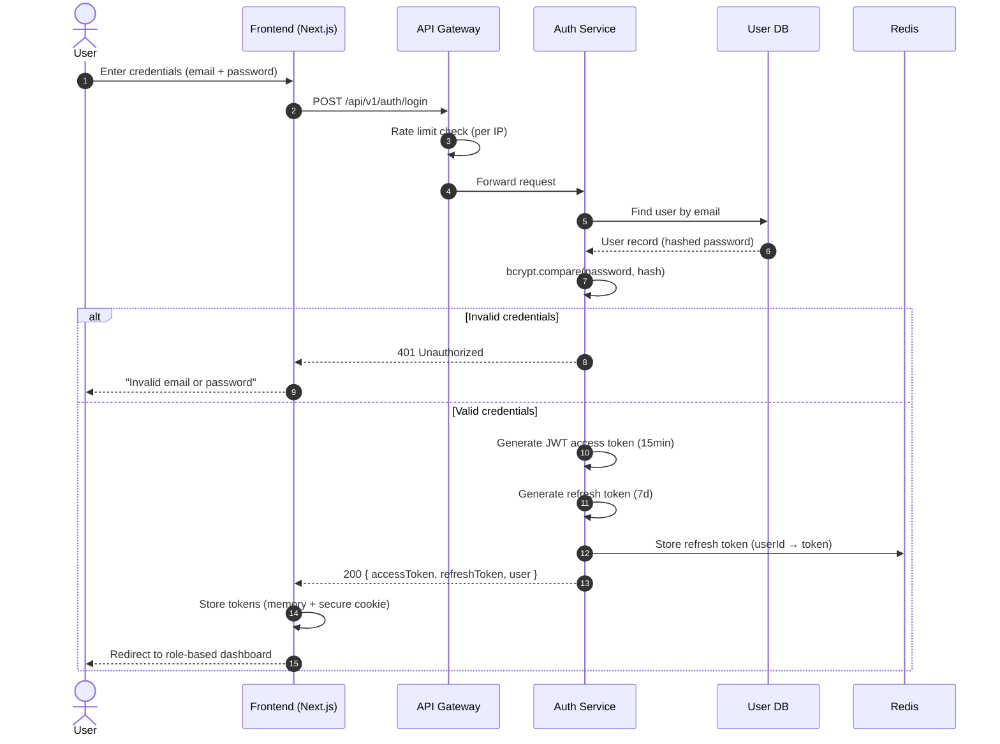
```mermaid
sequenceDiagram
    autonumber
    actor User
    participant FE as Frontend (Next.js)
    participant GW as API Gateway
    participant Auth as Auth Service
    participant DB as User DB
    participant Cache as Redis

    User->>FE: Enter credentials (email + password)
    FE->>GW: POST /api/v1/auth/login
    GW->>GW: Rate limit check (per IP)
    GW->>Auth: Forward request
    Auth->>DB: Find user by email
    DB-->>Auth: User record (hashed password)
    Auth->>Auth: bcrypt.compare(password, hash)

    alt Invalid credentials
        Auth-->>FE: 401 Unauthorized
        FE-->>User: "Invalid email or password"
    else Valid credentials
        Auth->>Auth: Generate JWT access token (15min)
        Auth->>Auth: Generate refresh token (7d)
        Auth->>Cache: Store refresh token (userId → token)
        Auth-->>FE: 200 { accessToken, refreshToken, user }
        FE->>FE: Store tokens (memory + secure cookie)
        FE-->>User: Redirect to role-based dashboard
    end
```

### 5.2 Token Refresh Flow

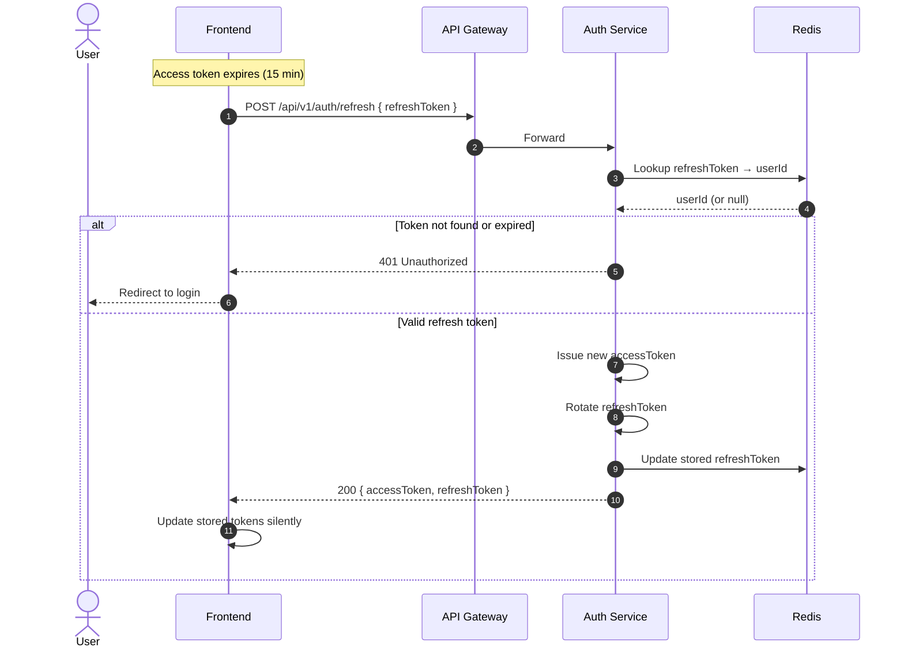
```mermaid
sequenceDiagram
    autonumber
    actor User
    participant FE as Frontend
    participant GW as API Gateway
    participant Auth as Auth Service
    participant Cache as Redis

    Note over FE: Access token expires (15 min)
    FE->>GW: POST /api/v1/auth/refresh { refreshToken }
    GW->>Auth: Forward
    Auth->>Cache: Lookup refreshToken → userId
    Cache-->>Auth: userId (or null)

    alt Token not found or expired
        Auth-->>FE: 401 Unauthorized
        FE-->>User: Redirect to login
    else Valid refresh token
        Auth->>Auth: Issue new accessToken
        Auth->>Auth: Rotate refreshToken
        Auth->>Cache: Update stored refreshToken
        Auth-->>FE: 200 { accessToken, refreshToken }
        FE->>FE: Update stored tokens silently
    end
```

### 5.3 Policy Creation — QDE → DDE → Underwriting → Issuance

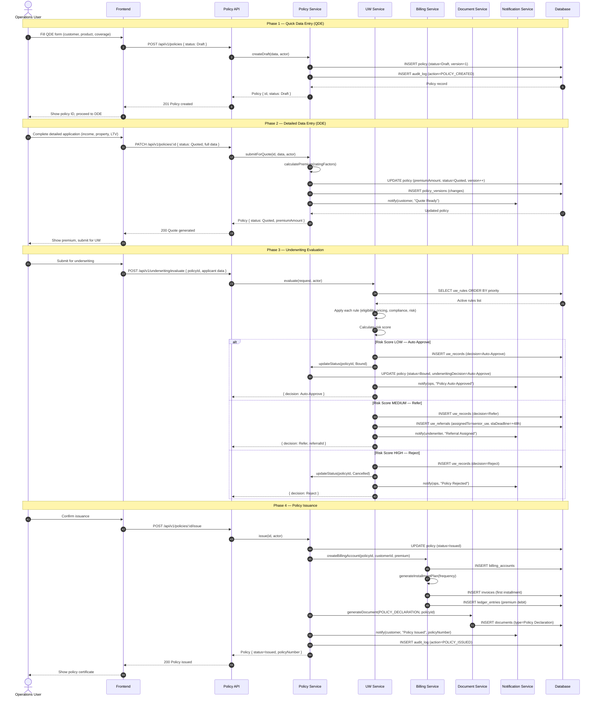
```mermaid
sequenceDiagram
    autonumber
    actor Ops as Operations User
    participant FE as Frontend
    participant API as Policy API
    participant PS as Policy Service
    participant UWS as UW Service
    participant BS as Billing Service
    participant DS as Document Service
    participant NS as Notification Service
    participant DB as Database

    %% ── QDE Phase ─────────────────────────────
    Note over Ops, DB: Phase 1 — Quick Data Entry (QDE)
    Ops->>FE: Fill QDE form (customer, product, coverage)
    FE->>API: POST /api/v1/policies { status: Draft }
    API->>PS: createDraft(data, actor)
    PS->>DB: INSERT policy (status=Draft, version=1)
    PS->>DB: INSERT audit_log (action=POLICY_CREATED)
    DB-->>PS: Policy record
    PS-->>API: Policy { id, status: Draft }
    API-->>FE: 201 Policy created
    FE-->>Ops: Show policy ID, proceed to DDE

    %% ── DDE Phase ─────────────────────────────
    Note over Ops, DB: Phase 2 — Detailed Data Entry (DDE)
    Ops->>FE: Complete detailed application (income, property, LTV)
    FE->>API: PATCH /api/v1/policies/:id { status: Quoted, full data }
    API->>PS: submitForQuote(id, data, actor)
    PS->>PS: calculatePremium(ratingFactors)
    PS->>DB: UPDATE policy (premiumAmount, status=Quoted, version++)
    PS->>DB: INSERT policy_versions (changes)
    PS->>NS: notify(customer, "Quote Ready")
    DB-->>PS: Updated policy
    PS-->>API: Policy { status: Quoted, premiumAmount }
    API-->>FE: 200 Quote generated
    FE-->>Ops: Show premium, submit for UW

    %% ── Underwriting Phase ──────────────────────
    Note over Ops, DB: Phase 3 — Underwriting Evaluation
    Ops->>FE: Submit for underwriting
    FE->>API: POST /api/v1/underwriting/evaluate { policyId, applicant data }
    API->>UWS: evaluate(request, actor)
    UWS->>DB: SELECT uw_rules ORDER BY priority
    DB-->>UWS: Active rules list
    UWS->>UWS: Apply each rule (eligibility, pricing, compliance, risk)
    UWS->>UWS: Calculate risk score

    alt Risk Score LOW — Auto Approve
        UWS->>DB: INSERT uw_records (decision=Auto-Approve)
        UWS->>PS: updateStatus(policyId, Bound)
        PS->>DB: UPDATE policy (status=Bound, underwritingDecision=Auto-Approve)
        UWS->>NS: notify(ops, "Policy Auto-Approved")
        UWS-->>API: { decision: Auto-Approve }
    else Risk Score MEDIUM — Refer
        UWS->>DB: INSERT uw_records (decision=Refer)
        UWS->>DB: INSERT uw_referrals (assignedTo=senior_uw, slaDeadline=+48h)
        UWS->>NS: notify(underwriter, "Referral Assigned")
        UWS-->>API: { decision: Refer, referralId }
    else Risk Score HIGH — Reject
        UWS->>DB: INSERT uw_records (decision=Reject)
        UWS->>PS: updateStatus(policyId, Cancelled)
        UWS->>NS: notify(ops, "Policy Rejected")
        UWS-->>API: { decision: Reject }
    end

    %% ── Issuance Phase ──────────────────────────
    Note over Ops, DB: Phase 4 — Policy Issuance
    Ops->>FE: Confirm issuance
    FE->>API: POST /api/v1/policies/:id/issue
    API->>PS: issue(id, actor)
    PS->>DB: UPDATE policy (status=Issued)
    PS->>BS: createBillingAccount(policyId, customerId, premium)
    BS->>DB: INSERT billing_accounts
    BS->>BS: generateInstallmentPlan(frequency)
    BS->>DB: INSERT invoices (first installment)
    BS->>DB: INSERT ledger_entries (premium debit)
    PS->>DS: generateDocument(POLICY_DECLARATION, policyId)
    DS->>DB: INSERT documents (type=Policy Declaration)
    PS->>NS: notify(customer, "Policy Issued", policyNumber)
    PS->>DB: INSERT audit_log (action=POLICY_ISSUED)
    PS-->>API: Policy { status=Issued, policyNumber }
    API-->>FE: 200 Policy issued
    FE-->>Ops: Show policy certificate
```

### 5.4 Underwriting Referral Resolution

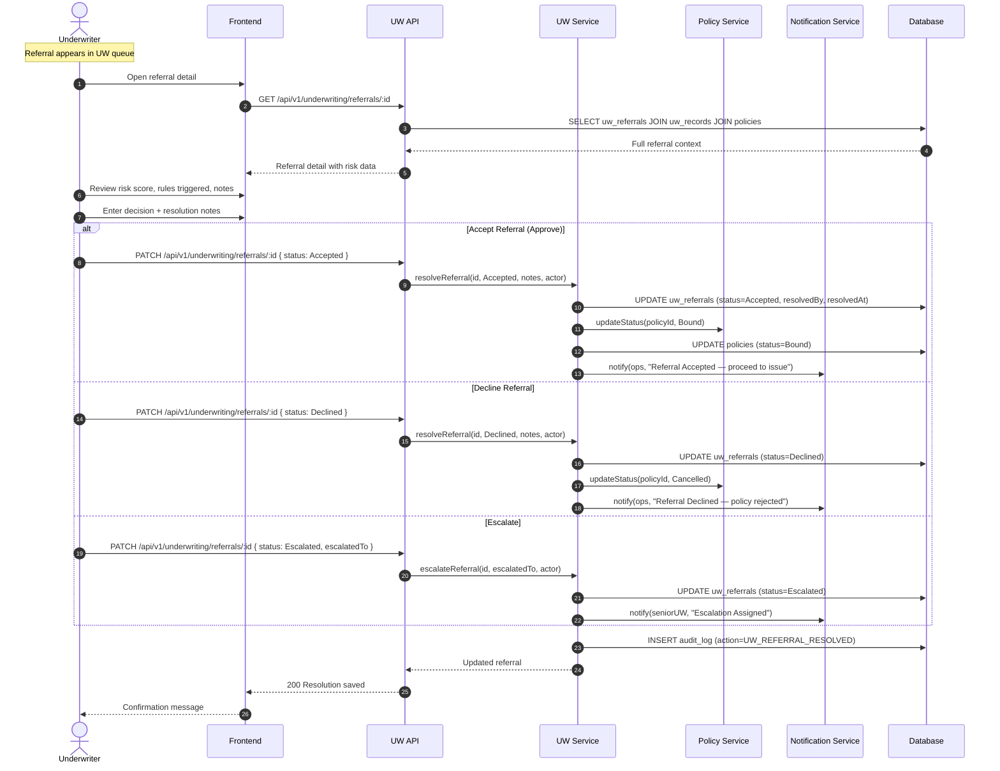
```mermaid
sequenceDiagram
    autonumber
    actor UW as Underwriter
    participant FE as Frontend
    participant API as UW API
    participant UWS as UW Service
    participant PS as Policy Service
    participant NS as Notification Service
    participant DB as Database

    Note over UW: Referral appears in UW queue
    UW->>FE: Open referral detail
    FE->>API: GET /api/v1/underwriting/referrals/:id
    API->>DB: SELECT uw_referrals JOIN uw_records JOIN policies
    DB-->>API: Full referral context
    API-->>FE: Referral detail with risk data

    UW->>FE: Review risk score, rules triggered, notes
    UW->>FE: Enter decision + resolution notes

    alt Accept Referral (Approve)
        UW->>API: PATCH /api/v1/underwriting/referrals/:id { status: Accepted }
        API->>UWS: resolveReferral(id, Accepted, notes, actor)
        UWS->>DB: UPDATE uw_referrals (status=Accepted, resolvedBy, resolvedAt)
        UWS->>PS: updateStatus(policyId, Bound)
        UWS->>DB: UPDATE policies (status=Bound)
        UWS->>NS: notify(ops, "Referral Accepted — proceed to issue")
    else Decline Referral
        UW->>API: PATCH /api/v1/underwriting/referrals/:id { status: Declined }
        API->>UWS: resolveReferral(id, Declined, notes, actor)
        UWS->>DB: UPDATE uw_referrals (status=Declined)
        UWS->>PS: updateStatus(policyId, Cancelled)
        UWS->>NS: notify(ops, "Referral Declined — policy rejected")
    else Escalate
        UW->>API: PATCH /api/v1/underwriting/referrals/:id { status: Escalated, escalatedTo }
        API->>UWS: escalateReferral(id, escalatedTo, actor)
        UWS->>DB: UPDATE uw_referrals (status=Escalated)
        UWS->>NS: notify(seniorUW, "Escalation Assigned")
    end

    UWS->>DB: INSERT audit_log (action=UW_REFERRAL_RESOLVED)
    UWS-->>API: Updated referral
    API-->>FE: 200 Resolution saved
    FE-->>UW: Confirmation message
```

### 5.5 FNOL Intake and Claims Registration

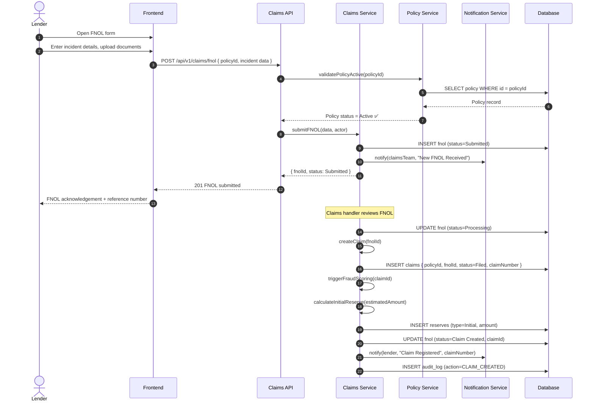
```mermaid
sequenceDiagram
    autonumber
    actor Lender
    participant FE as Frontend
    participant API as Claims API
    participant CS as Claims Service
    participant PS as Policy Service
    participant NS as Notification Service
    participant DB as Database

    Lender->>FE: Open FNOL form
    Lender->>FE: Enter incident details, upload documents
    FE->>API: POST /api/v1/claims/fnol { policyId, incident data }

    API->>PS: validatePolicyActive(policyId)
    PS->>DB: SELECT policy WHERE id = policyId
    DB-->>PS: Policy record
    PS-->>API: Policy status = Active ✅

    API->>CS: submitFNOL(data, actor)
    CS->>DB: INSERT fnol (status=Submitted)
    CS->>NS: notify(claimsTeam, "New FNOL Received")
    CS-->>API: { fnolId, status: Submitted }
    API-->>FE: 201 FNOL submitted
    FE-->>Lender: FNOL acknowledgement + reference number

    Note over CS: Claims handler reviews FNOL
    CS->>DB: UPDATE fnol (status=Processing)
    CS->>CS: createClaim(fnolId)
    CS->>DB: INSERT claims { policyId, fnolId, status=Filed, claimNumber }
    CS->>CS: triggerFraudScoring(claimId)
    CS->>CS: calculateInitialReserve(estimatedAmount)
    CS->>DB: INSERT reserves (type=Initial, amount)
    CS->>DB: UPDATE fnol (status=Claim Created, claimId)
    CS->>NS: notify(lender, "Claim Registered", claimNumber)
    CS->>DB: INSERT audit_log (action=CLAIM_CREATED)
```

### 5.6 Claim Adjudication and Settlement

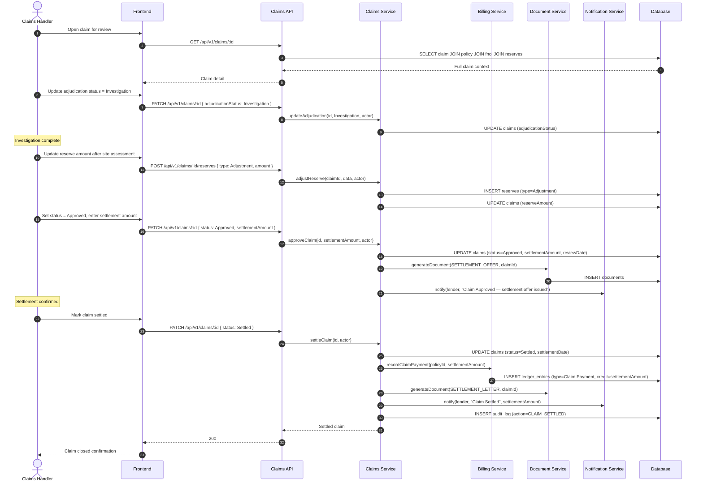
```mermaid
sequenceDiagram
    autonumber
    actor CH as Claims Handler
    participant FE as Frontend
    participant API as Claims API
    participant CS as Claims Service
    participant BS as Billing Service
    participant DS as Document Service
    participant NS as Notification Service
    participant DB as Database

    CH->>FE: Open claim for review
    FE->>API: GET /api/v1/claims/:id
    API->>DB: SELECT claim JOIN policy JOIN fnol JOIN reserves
    DB-->>API: Full claim context
    API-->>FE: Claim detail

    CH->>FE: Update adjudication status = Investigation
    FE->>API: PATCH /api/v1/claims/:id { adjudicationStatus: Investigation }
    API->>CS: updateAdjudication(id, Investigation, actor)
    CS->>DB: UPDATE claims (adjudicationStatus)

    Note over CH: Investigation complete
    CH->>FE: Update reserve amount after site assessment
    FE->>API: POST /api/v1/claims/:id/reserves { type: Adjustment, amount }
    API->>CS: adjustReserve(claimId, data, actor)
    CS->>DB: INSERT reserves (type=Adjustment)
    CS->>DB: UPDATE claims (reserveAmount)

    CH->>FE: Set status = Approved, enter settlement amount
    FE->>API: PATCH /api/v1/claims/:id { status: Approved, settlementAmount }
    API->>CS: approveClaim(id, settlementAmount, actor)
    CS->>DB: UPDATE claims (status=Approved, settlementAmount, reviewDate)
    CS->>DS: generateDocument(SETTLEMENT_OFFER, claimId)
    DS->>DB: INSERT documents
    CS->>NS: notify(lender, "Claim Approved — settlement offer issued")

    Note over CH: Settlement confirmed
    CH->>FE: Mark claim settled
    FE->>API: PATCH /api/v1/claims/:id { status: Settled }
    API->>CS: settleClaim(id, actor)
    CS->>DB: UPDATE claims (status=Settled, settlementDate)
    CS->>BS: recordClaimPayment(policyId, settlementAmount)
    BS->>DB: INSERT ledger_entries (type=Claim Payment, credit=settlementAmount)
    CS->>DS: generateDocument(SETTLEMENT_LETTER, claimId)
    CS->>NS: notify(lender, "Claim Settled", settlementAmount)
    CS->>DB: INSERT audit_log (action=CLAIM_SETTLED)
    CS-->>API: Settled claim
    API-->>FE: 200
    FE-->>CH: Claim closed confirmation
```

### 5.7 Billing — Invoice Generation and Payment Recording

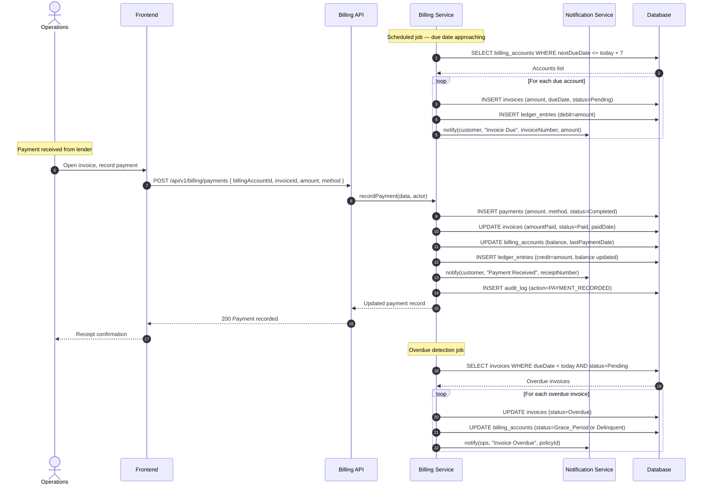
```mermaid
sequenceDiagram
    autonumber
    actor Ops as Operations
    participant FE as Frontend
    participant API as Billing API
    participant BS as Billing Service
    participant NS as Notification Service
    participant DB as Database

    Note over BS: Scheduled job — due date approaching
    BS->>DB: SELECT billing_accounts WHERE nextDueDate <= today + 7
    DB-->>BS: Accounts list

    loop For each due account
        BS->>DB: INSERT invoices (amount, dueDate, status=Pending)
        BS->>DB: INSERT ledger_entries (debit=amount)
        BS->>NS: notify(customer, "Invoice Due", invoiceNumber, amount)
    end

    Note over Ops: Payment received from lender
    Ops->>FE: Open invoice, record payment
    FE->>API: POST /api/v1/billing/payments { billingAccountId, invoiceId, amount, method }
    API->>BS: recordPayment(data, actor)
    BS->>DB: INSERT payments (amount, method, status=Completed)
    BS->>DB: UPDATE invoices (amountPaid, status=Paid, paidDate)
    BS->>DB: UPDATE billing_accounts (balance, lastPaymentDate)
    BS->>DB: INSERT ledger_entries (credit=amount, balance updated)
    BS->>NS: notify(customer, "Payment Received", receiptNumber)
    BS->>DB: INSERT audit_log (action=PAYMENT_RECORDED)
    BS-->>API: Updated payment record
    API-->>FE: 200 Payment recorded
    FE-->>Ops: Receipt confirmation

    Note over BS: Overdue detection job
    BS->>DB: SELECT invoices WHERE dueDate < today AND status=Pending
    DB-->>BS: Overdue invoices
    loop For each overdue invoice
        BS->>DB: UPDATE invoices (status=Overdue)
        BS->>DB: UPDATE billing_accounts (status=Grace_Period or Delinquent)
        BS->>NS: notify(ops, "Invoice Overdue", policyId)
    end
```

### 5.8 Policy Endorsement Flow

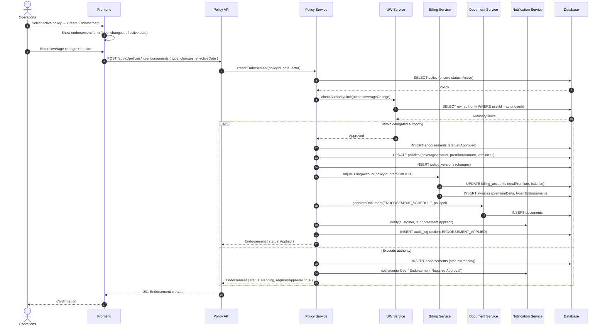
```mermaid
sequenceDiagram
    autonumber
    actor Ops as Operations
    participant FE as Frontend
    participant API as Policy API
    participant PS as Policy Service
    participant UWS as UW Service
    participant BS as Billing Service
    participant DS as Document Service
    participant NS as Notification Service
    participant DB as Database

    Ops->>FE: Select active policy → Create Endorsement
    FE->>FE: Show endorsement form (type, changes, effective date)
    Ops->>FE: Enter coverage change + reason
    FE->>API: POST /api/v1/policies/:id/endorsements { type, changes, effectiveDate }

    API->>PS: createEndorsement(policyId, data, actor)
    PS->>DB: SELECT policy (ensure status=Active)
    DB-->>PS: Policy

    PS->>UWS: checkAuthorityLimit(actor, coverageChange)
    UWS->>DB: SELECT uw_authority WHERE userId = actor.userId
    DB-->>UWS: Authority limits

    alt Within delegated authority
        UWS-->>PS: Approved
        PS->>DB: INSERT endorsements (status=Approved)
        PS->>DB: UPDATE policies (coverageAmount, premiumAmount, version++)
        PS->>DB: INSERT policy_versions (changes)
        PS->>BS: adjustBillingAccount(policyId, premiumDelta)
        BS->>DB: UPDATE billing_accounts (totalPremium, balance)
        BS->>DB: INSERT invoices (premiumDelta, type=Endorsement)
        PS->>DS: generateDocument(ENDORSEMENT_SCHEDULE, policyId)
        DS->>DB: INSERT documents
        PS->>NS: notify(customer, "Endorsement Applied")
        PS->>DB: INSERT audit_log (action=ENDORSEMENT_APPLIED)
        PS-->>API: Endorsement { status: Applied }
    else Exceeds authority
        PS->>DB: INSERT endorsements (status=Pending)
        PS->>NS: notify(seniorOps, "Endorsement Requires Approval")
        PS-->>API: Endorsement { status: Pending, requiresApproval: true }
    end

    API-->>FE: 201 Endorsement created
    FE-->>Ops: Confirmation
```

### 5.9 Policy Renewal Flow

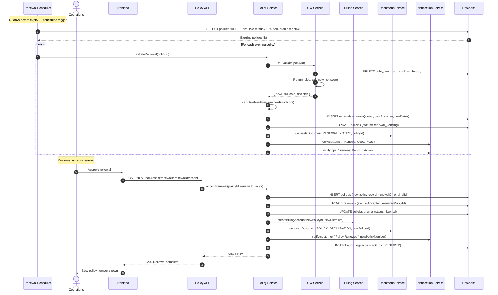
```mermaid
sequenceDiagram
    autonumber
    participant Job as Renewal Scheduler
    actor Ops as Operations
    participant FE as Frontend
    participant API as Policy API
    participant PS as Policy Service
    participant UWS as UW Service
    participant BS as Billing Service
    participant DS as Document Service
    participant NS as Notification Service
    participant DB as Database

    Note over Job: 60 days before expiry — scheduled trigger
    Job->>DB: SELECT policies WHERE endDate = today + 60 AND status = Active
    DB-->>Job: Expiring policies list
    loop For each expiring policy
        Job->>PS: initiateRenewal(policyId)
        PS->>UWS: reEvaluate(policyId)
        UWS->>DB: SELECT policy, uw_records, claims history
        UWS->>UWS: Re-run rules, calc new risk score
        UWS-->>PS: { newRiskScore, decision }
        PS->>PS: calculateNewPremium(newRiskScore)
        PS->>DB: INSERT renewals (status=Quoted, newPremium, newDates)
        PS->>DB: UPDATE policies (status=Renewal_Pending)
        PS->>DS: generateDocument(RENEWAL_NOTICE, policyId)
        PS->>NS: notify(customer, "Renewal Quote Ready")
        PS->>NS: notify(ops, "Renewal Pending Action")
    end

    Note over Ops: Customer accepts renewal
    Ops->>FE: Approve renewal
    FE->>API: POST /api/v1/policies/:id/renewals/:renewalId/accept
    API->>PS: acceptRenewal(policyId, renewalId, actor)
    PS->>DB: INSERT policies (new policy record, renewalOf=originalId)
    PS->>DB: UPDATE renewals (status=Accepted, renewedPolicyId)
    PS->>DB: UPDATE policies original (status=Expired)
    PS->>BS: createBillingAccount(newPolicyId, newPremium)
    PS->>DS: generateDocument(POLICY_DECLARATION, newPolicyId)
    PS->>NS: notify(customer, "Policy Renewed", newPolicyNumber)
    PS->>DB: INSERT audit_log (action=POLICY_RENEWED)
    PS-->>API: New policy
    API-->>FE: 200 Renewal complete
    FE-->>Ops: New policy number shown
```

### 5.10 Document Generation Flow

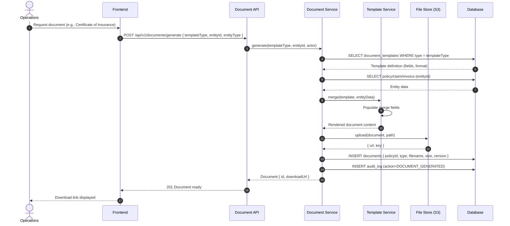
```mermaid
sequenceDiagram
    autonumber
    actor Ops as Operations
    participant FE as Frontend
    participant API as Document API
    participant DS as Document Service
    participant TS as Template Service
    participant FS as File Store (S3)
    participant DB as Database

    Ops->>FE: Request document (e.g., Certificate of Insurance)
    FE->>API: POST /api/v1/documents/generate { templateType, entityId, entityType }
    API->>DS: generate(templateType, entityId, actor)

    DS->>DB: SELECT document_templates WHERE type = templateType
    DB-->>DS: Template definition (fields, format)

    DS->>DB: SELECT policy/claim/invoice (entityId)
    DB-->>DS: Entity data

    DS->>TS: merge(template, entityData)
    TS->>TS: Populate merge fields
    TS-->>DS: Rendered document content

    DS->>FS: upload(document, path)
    FS-->>DS: { url, key }

    DS->>DB: INSERT documents { policyId, type, filename, size, version }
    DS->>DB: INSERT audit_log (action=DOCUMENT_GENERATED)
    DS-->>API: Document { id, downloadUrl }
    API-->>FE: 201 Document ready
    FE-->>Ops: Download link displayed
```

### 5.11 Bulk Operations Flow

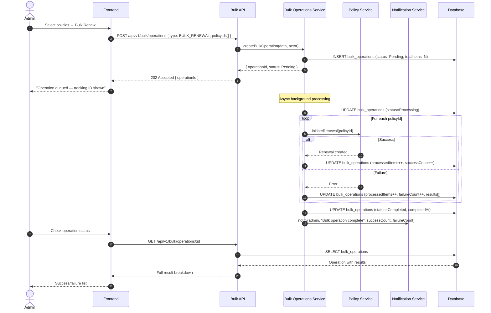
```mermaid
sequenceDiagram
    autonumber
    actor Admin
    participant FE as Frontend
    participant API as Bulk API
    participant BOS as Bulk Operations Service
    participant PS as Policy Service
    participant NS as Notification Service
    participant DB as Database

    Admin->>FE: Select policies → Bulk Renew
    FE->>API: POST /api/v1/bulk/operations { type: BULK_RENEWAL, policyIds[] }
    API->>BOS: createBulkOperation(data, actor)
    BOS->>DB: INSERT bulk_operations (status=Pending, totalItems=N)
    BOS-->>API: { operationId, status: Pending }
    API-->>FE: 202 Accepted { operationId }
    FE-->>Admin: "Operation queued — tracking ID shown"

    Note over BOS: Async background processing
    BOS->>DB: UPDATE bulk_operations (status=Processing)
    loop For each policyId
        BOS->>PS: initiateRenewal(policyId)
        alt Success
            PS-->>BOS: Renewal created
            BOS->>DB: UPDATE bulk_operations (processedItems++, successCount++)
        else Failure
            PS-->>BOS: Error
            BOS->>DB: UPDATE bulk_operations (processedItems++, failureCount++, results[])
        end
    end
    BOS->>DB: UPDATE bulk_operations (status=Completed, completedAt)
    BOS->>NS: notify(admin, "Bulk operation complete", successCount, failureCount)

    Admin->>FE: Check operation status
    FE->>API: GET /api/v1/bulk/operations/:id
    API->>DB: SELECT bulk_operations
    DB-->>API: Operation with results
    API-->>FE: Full result breakdown
    FE-->>Admin: Success/failure list
```

---

## 6. Data Flow Diagrams

### 6.1 End-to-End Policy Data Flow

```
LENDER / BORROWER
      │
      │ Loan origination data
      ▼
┌─────────────────────────────────────┐
│   QDE (Service Desk Intake)         │
│   • Customer identity               │
│   • Product selection               │
│   • Estimated coverage & loan amt   │
└────────────────┬────────────────────┘
                 │ Draft Policy
                 ▼
┌─────────────────────────────────────┐
│   DDE (Detailed Data Entry)         │
│   • Borrower financial profile      │
│   • Property details & valuation    │
│   • LTV ratio calculation           │
│   • Document uploads                │
└────────────────┬────────────────────┘
                 │ Premium Calculation
                 ▼
┌─────────────────────────────────────┐
│   UNDERWRITING ENGINE               │
│   • Rule evaluation (18+ rules)     │
│   • Risk score calculation          │
│   • Decision: Approve / Refer /     │
│     Reject                          │
│   • If Refer → Referral queue       │
└────────────────┬────────────────────┘
                 │ Decision output
                 ▼
┌─────────────────────────────────────┐
│   POLICY ISSUANCE                   │
│   • Policy number generated         │
│   • Policy declaration document     │
│   • Certificate of Insurance        │
│   • Billing account created         │
│   • Installment plan generated      │
└────────┬─────────────┬──────────────┘
         │             │
         ▼             ▼
┌──────────────┐  ┌───────────────────┐
│  BILLING     │  │  SERVICING        │
│  • Invoices  │  │  • NPA tracking   │
│  • Payments  │  │  • Delinquency    │
│  • Ledger    │  │  • Premium checks │
└──────────────┘  └───────────────────┘
         │
         │ Default / Loss event
         ▼
┌─────────────────────────────────────┐
│   CLAIMS PROCESSING                 │
│   • FNOL intake                     │
│   • Claim registration              │
│   • Reserve setting                 │
│   • Fraud scoring                   │
│   • Investigation / Negotiation     │
│   • Settlement & payment            │
└─────────────────────────────────────┘
```

### 6.2 Data Classification and Flow Security

```
┌─────────────────────────────────────────────────────────────┐
│  DATA SENSITIVITY CLASSIFICATION                            │
├──────────────┬──────────────────────────────────────────────┤
│  RESTRICTED  │  PAN, Aadhaar, Bank Account, Password Hash,  │
│  (Encrypted) │  Credit Score, Settlement Amounts            │
├──────────────┼──────────────────────────────────────────────┤
│ CONFIDENTIAL │  Policy premium, Coverage amount, Claim amt, │
│  (RBAC-gated)│  UW decision, Risk score                     │
├──────────────┼──────────────────────────────────────────────┤
│  INTERNAL    │  Policy status, Task assignments, Audit logs,│
│  (Auth-gated)│  Notifications, Reports                      │
├──────────────┼──────────────────────────────────────────────┤
│  PUBLIC      │  Product descriptions, coverage limits,      │
│  (Open)      │  Contact information                         │
└──────────────┴──────────────────────────────────────────────┘

Transport Layer:  All data → TLS 1.3
At-Rest Layer:    RESTRICTED fields → AES-256 column encryption
Logging Layer:    PII masked before write → [REDACTED]
Audit Layer:      All mutations → immutable audit_logs table
```

### 6.3 Integration Data Flow

```
┌──────────────────────────────────────────────────────┐
│           EXTERNAL INTEGRATION POINTS                │
│                                                      │
│  ┌─────────────────┐     ┌──────────────────────┐   │
│  │  Credit Bureau  │     │   Property Registry  │   │
│  │  (CIBIL/Experian│     │   (Valuation API)    │   │
│  │  credit score)  │     │                      │   │
│  └────────┬────────┘     └──────────┬───────────┘   │
│           │ REST / XML              │ REST           │
│           ▼                         ▼               │
│  ┌────────────────────────────────────────────────┐ │
│  │           Integration Adapter Layer             │ │
│  │   • Circuit breaker                            │ │
│  │   • Retry logic (exp. backoff)                 │ │
│  │   • Response caching (Redis, 24h TTL)          │ │
│  │   • Timeout enforcement (5s)                   │ │
│  └────────────────────┬───────────────────────────┘ │
│                        │                            │
│                        ▼                            │
│  ┌────────────────────────────────────────────────┐ │
│  │           IMGC PAS Core Backend                 │ │
│  └────────────────────────────────────────────────┘ │
│                        │                            │
│           ┌────────────┼────────────┐               │
│           ▼            ▼            ▼               │
│  ┌──────────────┐ ┌────────┐ ┌──────────────────┐  │
│  │  SMS Gateway │ │  Email │ │  Regulatory      │  │
│  │  (Twilio)    │ │  (SES) │ │  Reporting API   │  │
│  └──────────────┘ └────────┘ └──────────────────┘  │
└──────────────────────────────────────────────────────┘
```

---

## 7. API Design Reference

### 7.1 API Naming Conventions

```
Base URL: /api/v1

Pattern:
  GET    /resources              → List (paginated)
  GET    /resources/:id          → Get single
  POST   /resources              → Create
  PATCH  /resources/:id          → Partial update
  DELETE /resources/:id          → Soft delete

Sub-resources:
  POST   /policies/:id/endorsements
  POST   /policies/:id/renewals
  POST   /claims/:id/reserves
  POST   /documents/generate
```

### 7.2 Standard Response Envelope

```json
{
  "success": true,
  "data": { },
  "meta": {
    "page": 1,
    "limit": 20,
    "total": 245,
    "totalPages": 13
  },
  "timestamp": "2026-03-07T10:30:00Z",
  "requestId": "req_abc123"
}
```

```json
{
  "success": false,
  "error": {
    "code": "VALIDATION_ERROR",
    "message": "Request validation failed",
    "details": [
      { "field": "coverageAmount", "message": "Must be between 100000 and 10000000" }
    ]
  },
  "timestamp": "2026-03-07T10:30:00Z",
  "requestId": "req_abc123"
}
```

### 7.3 API Endpoint Catalogue

| Method | Endpoint | Auth | Role | Description |
|---|---|---|---|---|
| POST | /auth/login | ❌ | — | User login |
| POST | /auth/refresh | ❌ | — | Refresh access token |
| POST | /auth/logout | ✅ | All | Invalidate session |
| GET | /policies | ✅ | All | List policies (paged, filtered) |
| POST | /policies | ✅ | Admin, Ops | Create policy draft (QDE) |
| GET | /policies/:id | ✅ | All | Get policy detail |
| PATCH | /policies/:id | ✅ | Admin, Ops | Update policy (DDE, status change) |
| POST | /policies/:id/issue | ✅ | Admin, Ops | Issue policy |
| POST | /policies/:id/cancel | ✅ | Admin, Ops | Cancel policy |
| POST | /policies/:id/reinstate | ✅ | Admin, Ops | Reinstate lapsed policy |
| POST | /policies/:id/endorsements | ✅ | Admin, Ops | Create endorsement |
| POST | /policies/:id/renewals | ✅ | Admin, Ops | Initiate renewal |
| POST | /underwriting/evaluate | ✅ | Admin, UW | Run UW evaluation |
| GET | /underwriting/referrals | ✅ | Admin, UW | List referrals |
| PATCH | /underwriting/referrals/:id | ✅ | Admin, UW | Resolve referral |
| POST | /claims/fnol | ✅ | Admin, Ops, Claims | File FNOL |
| GET | /claims | ✅ | Admin, Ops, Claims | List claims |
| GET | /claims/:id | ✅ | All | Get claim detail |
| PATCH | /claims/:id | ✅ | Admin, Claims | Update claim status |
| POST | /claims/:id/reserves | ✅ | Admin, Claims | Adjust reserve |
| GET | /billing/accounts | ✅ | Admin, Ops | List billing accounts |
| GET | /billing/invoices | ✅ | Admin, Ops | List invoices |
| POST | /billing/payments | ✅ | Admin, Ops | Record payment |
| GET | /billing/ledger/:accountId | ✅ | Admin, Ops | Get ledger |
| POST | /documents/generate | ✅ | Admin, Ops | Generate document from template |
| GET | /documents/:id | ✅ | All | Download document |
| GET | /reports/dashboard | ✅ | All | KPI dashboard data |
| GET | /reports/loss-ratio | ✅ | Admin, Ops | Loss ratio report |
| POST | /bulk/operations | ✅ | Admin | Initiate bulk operation |
| GET | /bulk/operations/:id | ✅ | Admin | Track bulk operation |

### 7.4 Security Headers Applied

```
Content-Security-Policy: default-src 'self'
Strict-Transport-Security: max-age=31536000; includeSubDomains
X-Content-Type-Options: nosniff
X-Frame-Options: DENY
X-XSS-Protection: 1; mode=block
Referrer-Policy: strict-origin-when-cross-origin
Permissions-Policy: geolocation=(), camera=()
```

---

## 8. Deployment Architecture

### 8.1 Container Architecture

```
┌──────────────────────────────────────────────────────────────────┐
│                    KUBERNETES CLUSTER                            │
│                                                                  │
│  ┌──────────────────────────────────────────────────────────┐   │
│  │                    INGRESS CONTROLLER                     │   │
│  │              (NGINX + SSL Termination + WAF)              │   │
│  └──────────────────────────┬───────────────────────────────┘   │
│                              │                                   │
│          ┌───────────────────┼────────────────────┐             │
│          ▼                   ▼                    ▼             │
│  ┌──────────────┐   ┌──────────────────┐   ┌──────────────────┐ │
│  │  Frontend    │   │  Backend API     │   │  Background      │ │
│  │  Deployment  │   │  Deployment      │   │  Workers         │ │
│  │  (Next.js)   │   │  (Express.js)    │   │  (Bull/BullMQ)   │ │
│  │  replicas: 2 │   │  replicas: 3     │   │  replicas: 2     │ │
│  └──────────────┘   └──────────────────┘   └──────────────────┘ │
│                              │                                   │
│          ┌───────────────────┼────────────────────┐             │
│          ▼                   ▼                    ▼             │
│  ┌──────────────┐   ┌──────────────────┐   ┌──────────────────┐ │
│  │  PostgreSQL  │   │  Redis Cluster   │   │  File Store      │ │
│  │  (Primary +  │   │  (Cache +        │   │  (S3 / Azure     │ │
│  │   Replica)   │   │   Sessions +     │   │   Blob)          │ │
│  │              │   │   Job Queue)     │   │                  │ │
│  └──────────────┘   └──────────────────┘   └──────────────────┘ │
│                                                                  │
│  ┌──────────────────────────────────────────────────────────┐   │
│  │    CONFIG MAPS · SECRETS (Vault-injected) · HPA rules    │   │
│  └──────────────────────────────────────────────────────────┘   │
└──────────────────────────────────────────────────────────────────┘
```

### 8.2 CI/CD Pipeline

```
Developer pushes to feature branch
              │
              ▼
┌─────────────────────────────┐
│       PULL REQUEST          │
│  • Branch protection check  │
│  • Reviewer assignment      │
└──────────────┬──────────────┘
               │
               ▼
┌─────────────────────────────┐
│    CI PIPELINE (GitHub      │
│    Actions / GitLab CI)     │
│                             │
│  1. Lint (ESLint, Prettier) │
│  2. TypeScript type-check   │
│  3. Unit tests (Jest)       │
│  4. Integration tests       │
│  5. SAST (SonarQube)        │
│  6. Dependency audit        │
│  7. Docker image build      │
│  8. Image vulnerability scan│
└──────────────┬──────────────┘
               │ All pass
               ▼
┌─────────────────────────────┐
│    CODE REVIEW (human)      │
│    Min 1 approval required  │
└──────────────┬──────────────┘
               │ Approved
               ▼
┌─────────────────────────────┐
│    MERGE TO MAIN            │
│                             │
│    CD: Deploy to Staging    │
│  • Helm chart deploy        │
│  • DB migrations (Flyway)   │
│  • E2E tests (Playwright)   │
│  • DAST scan (OWASP ZAP)    │
│  • Performance test (k6)    │
└──────────────┬──────────────┘
               │ Staging pass
               ▼
┌─────────────────────────────┐
│  PRODUCTION DEPLOYMENT      │
│  (Manual approval gate)     │
│                             │
│  • Blue/Green deploy        │
│  • Smoke tests              │
│  • Synthetic monitoring     │
│  • Rollback ready           │
└─────────────────────────────┘
```

### 8.3 Monitoring and Observability Stack

```
┌────────────────────────────────────────────────────────────────┐
│                    OBSERVABILITY PLATFORM                      │
│                                                                │
│  METRICS              LOGS                  TRACES             │
│  ┌──────────┐         ┌──────────┐          ┌──────────┐      │
│  │Prometheus│         │  ELK /   │          │  Jaeger  │      │
│  │+ Grafana │         │ OpenSearch│          │(OTEL)    │      │
│  │          │         │          │          │          │      │
│  │• API RPS │         │• Struct. │          │• Dist.   │      │
│  │• Latency │         │  JSON    │          │  traces  │      │
│  │• Error % │         │• Masked  │          │• Request │      │
│  │• DB pool │         │  PII     │          │  spans   │      │
│  └──────────┘         └──────────┘          └──────────┘      │
│                                                                │
│  ALERTING             DASHBOARDS             SYNTHETIC         │
│  ┌──────────┐         ┌──────────┐          ┌──────────┐      │
│  │PagerDuty │         │ Grafana  │          │Checkly / │      │
│  │/ OpsGenie│         │ Business │          │Datadog   │      │
│  │          │         │ KPI view │          │Synthetics│      │
│  │P1: 15min │         │          │          │          │      │
│  │P2: 30min │         │Loss ratio│          │User      │      │
│  │SLA aware │         │Combined  │          │journey   │      │
│  └──────────┘         └──────────┘          └──────────┘      │
└────────────────────────────────────────────────────────────────┘
```

---

*Document maintained by the Enterprise Architecture team.*
*Review cycle: Per major release or architectural change.*
*Version: 1.0 | March 2026*
